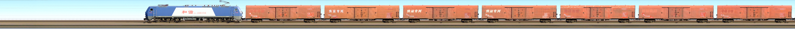
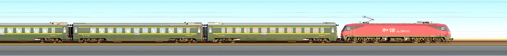
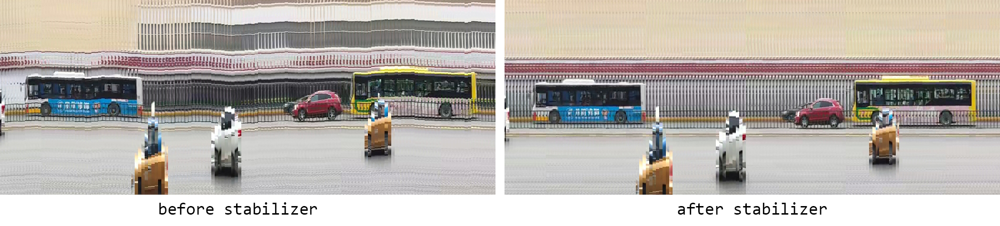
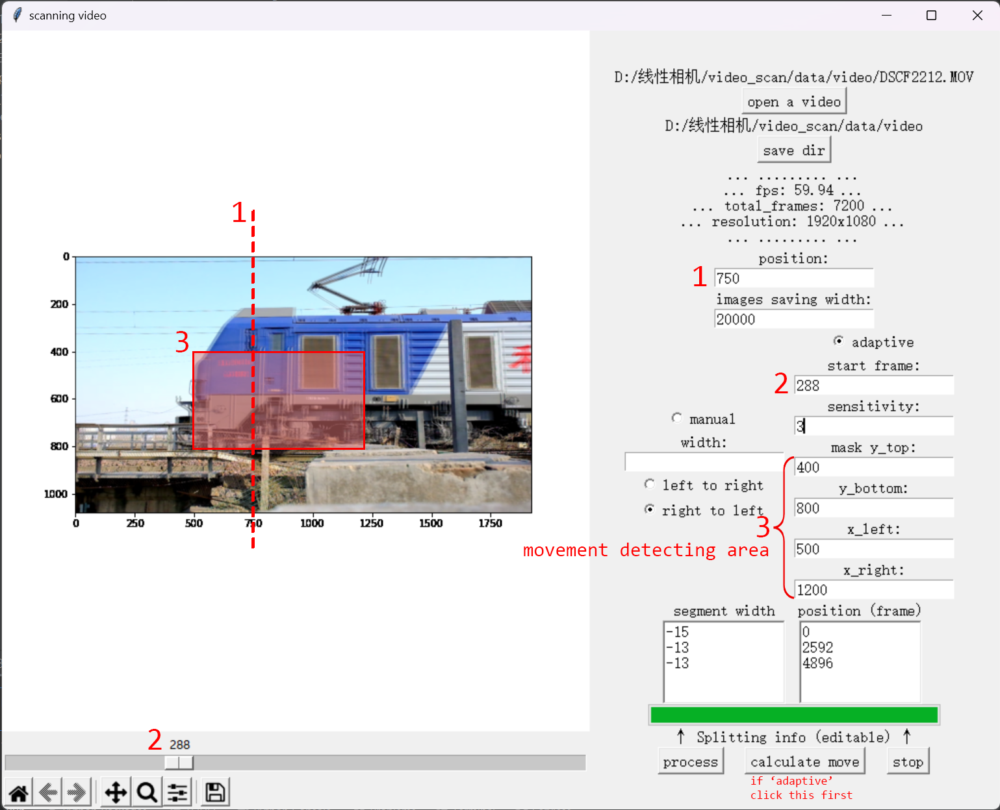
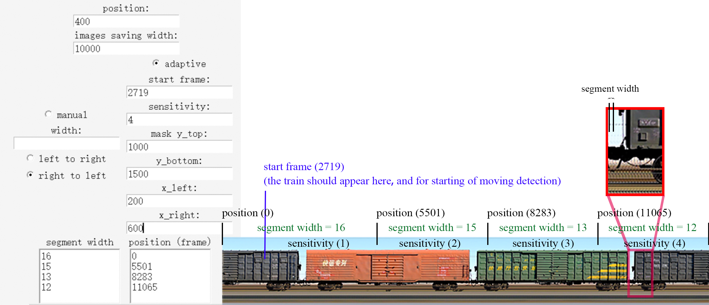

:star: A release on Windows and Ubuntu is updated: https://github.com/divertingPan/video_scanner/releases

# video_scanner
Generate the scanning image from a video

How to use the source code: run main.py within a python env

How to use the release software: run the executable 'scan_ver_0.3' in the main folder

## v0.3.5:

1. Fixed a bug where detection failed when adaptive sensitivity = 1.
2. Added a video stabilizer to help smooth handheld shooting videos.

The algorithm utilizes the first frame as an 'anchor' frame and detects keypoints. Subsequent frames are aligned to the keypoints detected in the first frame. 

Note: To achieve optimal results with the video stabilizer, the foreground and background of the moving object should not be too 'clean' (for providing enough keypoints to matching), and should not change too much during the video. To preview the stabilizer, mark the 'video stabilizer' option before loading the video. If you have already loaded a video, mark the option and reload the video. Additionally, if you wish to calculate the movement with the stabilizer, mark the option before clicking 'calculate move'. 

Known problem: enabling the stabilizer significantly SLOWS DOWN the generation process.

## v0.3.4:

The preview of the loaded video is optimized. Now the responding speed is faster when dragging the scrollbar.

## v0.3.3:

1. Now the movement detection results can be edited. First to click the 'calculate move' button to get the movement information. Then click 'process'. Of course you can modify the movement information in the textbox. (The first number of position frame is always '0', representing the start frame of detection position.)

For better understanding the parameters of splitting, referring to the following example.

2. Add a 'stop' button to interrupt the process.

3. update the save_img function, now it saves the jpeg file with 100% quality.

## v0.3:

1. The default save directory is the rootpath of the imported video.

2. cv2.imwrite() is replaced by cv2.imencode() to support special characters in the save path. 

3. Add the prompt of segment width under 'adaptive' mode to check the moving detection results. 

## v0.2:

Add the adaptive movement detection.

Blog: https://divertingpan.github.io/post/moving_detection/

## v0.1:

Blog: https://divertingpan.github.io/post/train_scanning/

## Hardware Solution
See repo: https://github.com/divertingPan/Line_Scan_Camera
